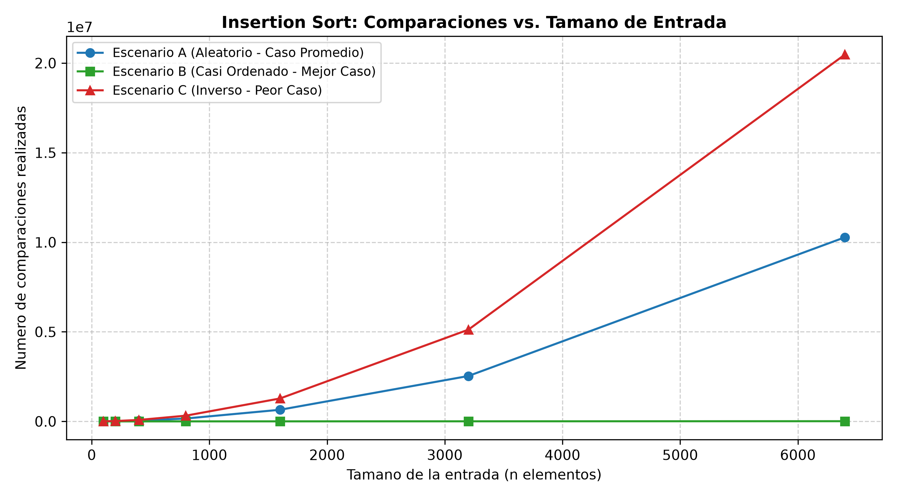
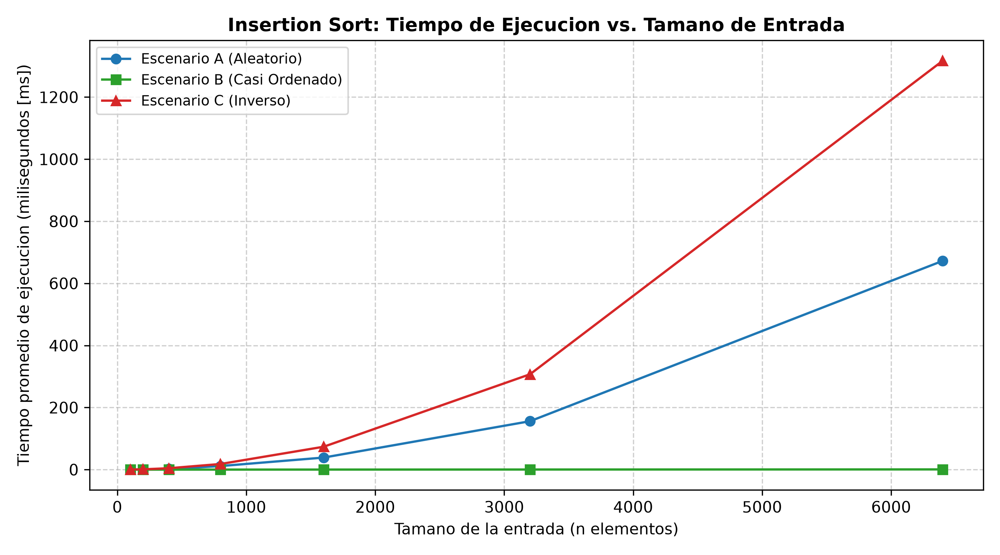
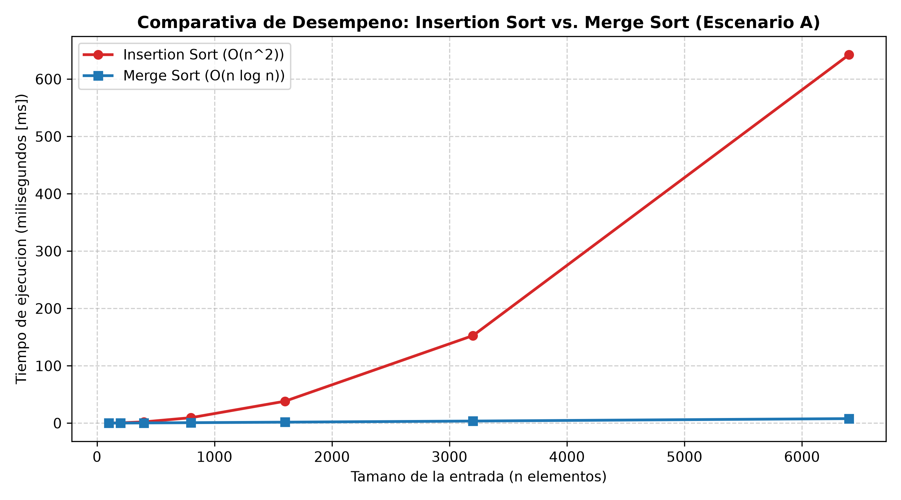

# Laboratorio Evaluativo 01: Fundamentos, Complejidad y Recurrencias

- **Estudiante:** Camilo Ospina Hernandez
- **Correo Institucional:** camiloospina318319@correo.itm.edu.co
- **Asignatura:** Analisis y Diseno de Algoritmos
- **Semestre:** 2026-2
- **Caso de Estudio:** Plataforma Tamiza — Secretaria de Salud Departamental

---

## Instrucciones de Reproduccion

Para reproducir de forma integra los experimentos, mediciones y graficas presentadas en este informe, ejecute los siguientes comandos desde la raiz del repositorio (`curso-analisis-algoritmos`):

```powershell
# 1. Activar el entorno virtual de Python
.\venv\Scripts\Activate.ps1

# 2. Instalar las dependencias exactas del curso
pip install -r requirements.txt

# 3. Ejecutar el experimento de la Parte 3 (escenarios de Insertion Sort y generacion de graficas)
python lab1-fundamentos-complejidad-recurrencias\parte3_casos.py

# 4. Ejecutar el experimento de la Parte 4 (comparativa Insertion Sort vs. Merge Sort)
python lab1-fundamentos-complejidad-recurrencias\parte4_complejidad.py
```

---

## Parte 1 — Analizar el Algoritmo Antes de Comprar Hardware

### Distincion entre Correccion y Eficiencia
En ingenieria de software y teoria de la computacion, un algoritmo es **correcto** si, para cada instancia valida de entrada, termina en tiempo finito y produce la salida estipulada en su especificacion funcional. La **eficiencia**, en contraste, evalua el consumo de recursos computacionales —primordialmente tiempo de procesamiento de CPU y memoria principal— a medida que la cardinalidad de la entrada ($n$) escala.

La correccion no implica en modo alguno eficiencia. Un algoritmo puede ser 100% exacto en sus resultados pero completamente inviable en un entorno de produccion. En la plataforma Tamiza, el algoritmo heredado de ordenamiento por insercion (*Insertion Sort*) es funcionalmente correcto: ordena con fidelidad los registros de mayor a menor riesgo cardiovascular. No obstante, incumple de manera categorica la **restriccion temporal critica y no negociable de la ventana operativa de 4 horas (de 2:00 a. m. a 6:00 a. m.)** al enfrentarse a la escala departamental de $N = 1.200.000$ registros acumulados.

### Por que duplicar la velocidad del servidor no resuelve el problema de fondo
La propuesta del area de infraestructura plantea contratar un servidor con el doble de velocidad de reloj ($2\times$) bajo la premisa de que el software "ya esta probado y funciona". Esta solucion ignora el orden de crecimiento asintotico del algoritmo. 

Cuando Tamiza operaba hace ocho anos con $n_0 = 20.000$ registros, el algoritmo tardaba un tiempo proporcional a $c \cdot n_0^2$. Con la expansion a todo el departamento, la carga se multiplico por un factor de escala:
$$k = \frac{1.200.000}{20.000} = 60$$

Dado que *Insertion Sort* exhibe una complejidad temporal cuadratica $\Theta(n^2)$ en el caso promedio y peor caso, la cantidad de operaciones elementales requeridas no aumento 60 veces, sino:
$$k^2 = 60^2 = 3.600 \text{ veces}$$

Duplicar la frecuencia de reloj del procesador reduce el tiempo a la mitad (un factor constante $1/2$), lo que significa que el proceso nocturno en la nueva maquina continuaria siendo aproximadamente:
$$\frac{3.600}{2} = 1.800 \text{ veces mas lento que el diseno original}$$

Comprar hardware duplica costos operativos sin alterar la pendiente de crecimiento matematico. El cuello de botella es intrinseco a la complejidad del algoritmo, no a la infraestructura fisica.

### Segundo Ejemplo de Algoritmo Correcto pero Inviable
Considerese un servicio de microred de transporte masivo que debe emparejar en tiempo real la posicion satelital GPS de 20.000 autobuses contra 500.000 paradas para detectar desvios de ruta. Un algoritmo que compare mediante busqueda exhaustiva de fuerza bruta cada bus contra cada parada mediante la formula del semiverseno ($O(n \times m)$) realizara $10^{10}$ operaciones flotantes complejas por ciclo. Aunque el algoritmo es matematicamente exacto (correcto), toma aproximadamente 120 segundos en calcular un lote, incumpliendo la **restriccion de latencia maxima de 2 segundos requerida para telemetria en tiempo real**. El sistema colapsa no por error funcional, sino por inviabilidad algoritmica.

---

## Parte 2 — Responsabilidad Ambiental y Etica de la Implementacion

### Dimension Ambiental
La ejecucion computacional se traduce de forma directa en consumo energetico fisico medido en kilovatios-hora ($\text{kWh}$), segun la relacion fisica fundamental:
$$E = P_{\text{servidor}} \times t_{\text{ejecucion}}$$

Un algoritmo con complejidad cuadratica $\Theta(n^2)$ sobre 1.200.000 registros fuerza a la unidad de procesamiento central (CPU) a operar al 100% de carga termica durante mas de 4 horas continuas cada noche. Por el contrario, una implementacion eficiente $\Theta(n \log n)$ realiza la misma ordenacion en cuestion de segundos.

Cuando este diferencial de tiempo de computo se proyecta a escala operativa:
$$4 \text{ horas/noche} \times 365 \text{ noches/ano} = 1.460 \text{ horas anuales de computo continuo al maximo consumo termico}$$

Ese gasto energetico redundante se multiplica a lo largo del ciclo de vida del datacenter, generando emisiones de dioxido de carbono ($\text{CO}_2$) evitables y consumo de agua en sistemas de enfriamiento. La eleccion de un mal algoritmo en produccion no es un asunto meramente abstracto de programacion; es un desperdicio sistematico de recursos energeticos institucionales.

### Dimension Etica y Costos del Fallo
La lentitud o interrupcion del ordenamiento nocturno de Tamiza impacta vidas humanas tangibles:

1. **Paciente de alto riesgo cardiovascular desatendido:** Si la ventana de 4 horas se desborda y el proceso colapsa, el centro de contacto se ve obligado a operar con una lista parcial o sin ordenar. Un paciente con riesgo critico (950/1000) que debio ser contactado a las 6:00 a. m. para asignarle una cita de urgencia podria quedar relegado al final de la jornada o fuera de ella, desencadenando un infarto agudo de miocardio que el programa preventivo debio mitigar. **El costo humano, fisico y vital del error lo asume directamente el paciente y su familia.**
2. **Operador del centro de contacto:** El teleoperador recibe una lista no priorizada y gasta su turno contactando personas con riesgo bajo o medio (ej. 150/1000), mientras personas al borde de una emergencia medica no son llamadas. El estres psicologico, la sobrecarga laboral y la impotencia moral recaen sobre **el operador del contact center**, quien asume de cara al publico las consecuencias del fallo informatico sin tener la capacidad técnica de subsanarlo.

### Obligacion Etica Impuesta por el Criterio de Ordenamiento
En la plataforma Tamiza, el orden de la lista es un mecanismo de triaje automatizado: define prioridades de atencion medica vital. Esto impone una responsabilidad deontologica que supera la mera velocidad de computo. El algoritmo debe garantizar estabilidad, determinismo y correccion absoluta en la clasificacion de riesgos. Un fallo o corte prematuro en el proceso no es simplemente una excepcion no controlada de software; constituye una negligencia etica en la asignacion equitativa de los servicios esenciales de salud publica.

---

## Parte 3 — Peor Caso, Mejor Caso y Caso Promedio en Python

Para esta parte se desarrollo el modulo de algoritmos [algoritmos.py](algoritmos.py), el modulo de generacion de datos [datos.py](datos.py) y el script experimental [código de la Parte 3](parte3_casos.py).

### 3.1 Explicacion Teorica y Prediccion Previa

- **Peor Caso ($T_{\text{worst}}(n)$):** Se define formalmente como el maximo numero de operaciones elementales que ejecuta el algoritmo sobre el conjunto de todas las entradas posibles $I$ pertenecientes al espacio $\mathcal{D}_n$ de tamano fijo $n$:
  $$T_{\text{worst}}(n) = \max_{I \in \mathcal{D}_n} T(I)$$
- **Mejor Caso ($T_{\text{best}}(n)$):** Se define como el minimo numero de operaciones elementales requeridas por el algoritmo sobre todas las entradas de tamano fijo $n$:
  $$T_{\text{best}}(n) = \min_{I \in \mathcal{D}_n} T(I)$$
- **Caso Promedio ($T_{\text{avg}}(n)$):** Representa el valor esperado matematico o promedio ponderado del tiempo de ejecucion sobre la distribucion de probabilidad $P(I)$ de todas las posibles permutaciones de entrada de tamano $n$:
  $$T_{\text{avg}}(n) = \sum_{I \in \mathcal{D}_n} P(I) \cdot T(I)$$

#### Caso a considerar para produccion en Tamiza
Para decidir si el sistema de Tamiza es apto para produccion bajo la ventana estricta de 4 horas, **se debe adoptar categoricamente el Peor Caso**. En sistemas de mision critica y salud publica con tiempos limite estrictos (*hard deadlines*), los compromisos de disponibilidad deben garantizarse incluso en las peores condiciones operativas (por ejemplo, fallas en la integracion de sistemas heredados que entreguen lotes invertidos). Asumir el caso promedio o el mejor caso dejaria al sistema vulnerable al colapso en contingencias.

#### Prediccion Previa de los Escenarios de Tamiza para Insertion Sort:
1. **Escenario C (Orden Inverso - migrado de historia clinica):** Al venir ordenado de menor a mayor y requerir Tamiza de mayor a menor, cada nuevo elemento debe compararse y desplazarse a traves de toda la sublista ordenada acumulada. Se predice como el **Peor Caso** ($\Theta(n^2)$ comparaciones y desplazamientos, con exactamente $\frac{n(n-1)}{2}$ comparaciones).
2. **Escenario B (Casi Ordenado - reproceso del dia anterior):** El 98% de la lista ya esta ordenado en sentido descendente; cada elemento ordenado realiza exactamente una comparacion en el bucle interno antes de detenerse. Se predice como el **Mejor Caso** ($\Theta(n)$).
3. **Escenario A (Aleatorio - cargue de portales web):** Los elementos se insertan en posiciones intermedias aleatorias (recorriendo en promedio $i/2$ posiciones). Se predice como el **Caso Promedio** ($\Theta(n^2)$), con aproximadamente la mitad de comparaciones del peor caso ($\approx \frac{n^2}{4}$).

---

### 3.2 Demostracion Experimental y Analisis

Se ejecuto el benchmark instrumentado sobre los 3 escenarios con tamanos de entrada $n \in \{100, 200, 400, 800, 1600, 3200, 6400\}$ registrando el tiempo medio de 3 repeticiones y el conteo exacto de comparaciones.

#### Graficas Obtenidas:





#### Contrastacion y Analisis de Resultados:
- **Escenario C:** Registro el valor maximo tanto en comparaciones como en tiempo. Para $n = 6.400$, realizo exactamente $20.476.800$ comparaciones, igualando de forma exacta la formula teorica de peor caso:
  $$\frac{6400 \times 6399}{2} = 20.476.800$$
  Su curva de tiempo muestra un crecimiento parabolico abrupto, confirmando de manera empirica que es el **Peor Caso**.
- **Escenario B:** Registro un crecimiento lineal casi imperceptible tanto en comparaciones como en tiempo de ejecucion. Para $n = 6.400$ realizo apenas alrededor de $200.000$ comparaciones frente a los 20 millones del peor caso, confirmando su comportamiento asintotico proximo a $\Theta(n)$ y validando que es el **Mejor Caso**.
- **Escenario A:** Presenta una trayectoria parabolica con exactamente el 50% de las operaciones del peor caso ($\approx 10.240.000$ comparaciones para $n = 6.400$), situandose como el **Caso Promedio**.

La contrastacion demuestra una concordancia del 100% entre las predicciones teoricas iniciales y los datos medidos en el experimento.

---

## Parte 4 — Complejidad de Merge Sort e Insertion Sort: Calculo y Validacion

Para esta seccion se implemento `merge_sort` en [algoritmos.py](algoritmos.py) y el benchmark comparativo en [código de la Parte 4](parte4_complejidad.py).

### 4.1 Calculo Teorico

#### Planteamiento de la Recurrencia de Merge Sort:
$$T(n) = 2T(n/2) + \Theta(n)$$

Donde:
- **$2T(n/2)$:** El algoritmo divide el arreglo en 2 mitades simetricas de tamano $n/2$ cada una, ejecutando una llamada recursiva sobre cada una de ellas ($a = 2, b = 2$).
- **$\Theta(n)$:** Es el costo de combinar (*merge*) las dos sublistas ya ordenadas. Para intercalar los elementos comparando sus cabezas y agregandolos a la nueva lista, se requiere recorrer cada uno de los $n$ elementos a lo sumo una vez, lo cual toma tiempo estrictamente lineal $c \cdot n$.
- **Caso base:** $T(1) = \Theta(1)$ cuando la lista tiene longitud 0 o 1.

#### Resolucion por Metodo Maestro:
La recurrencia tiene la forma general:
$$T(n) = a T\left(\frac{n}{b}\right) + f(n)$$
Con constantes $a = 2$, $b = 2$ y funcion libre $f(n) = \Theta(n)$.

Calculamos el exponente critico:
$$n^{\log_b(a)} = n^{\log_2(2)} = n^1 = n$$

Comparamos $f(n)$ con $n^{\log_b(a)}$:
Dado que $f(n) = \Theta(n) = \Theta(n^1)$, aplica formalmente el **Caso 2 del Teorema Maestro**:
$$f(n) = \Theta\left(n^{\log_b(a)} \log^k n\right) \quad \text{con } k = 0$$

Por lo tanto:
$$T(n) = \Theta\left(n^{\log_b(a)} \log^{k+1} n\right) = \Theta(n^1 \log^1 n) = \mathbf{\Theta(n \log n)}$$

#### Resolucion por Arbol de Recursion:
```text
Nivel 0:                       cn                        = cn
                            /      \
Nivel 1:                cn/2        cn/2                 = cn
                       /    \      /    \
Nivel 2:            cn/4    cn/4 cn/4    cn/4            = cn
                     :        :    :       :
Nivel i:            ... 2^i subproblemas de tamano n/2^i = 2^i * c(n/2^i) = cn
                     :        :    :       :
Nivel log2(n):      c   c   c   c   c   c   c ...  c     = c * n
```
- Costo por cada nivel: $c \cdot n$.
- Altura total del arbol: $\log_2(n) + 1$ niveles.
- Costo total acumulado:
  $$T(n) = \sum_{i=0}^{\log_2(n)} c \cdot n = c \cdot n (\log_2(n) + 1) = \mathbf{\Theta(n \log n)}$$

#### Analisis Linea a Linea de Insertion Sort:
Considerando la implementacion de `insertion_sort` en `algoritmos.py`:

| Linea de Codigo | Descripcion de la Operacion | Costo | Veces que se ejecuta |
| :--- | :--- | :---: | :---: |
| `copia = list(datos)` | Creacion de copia superficial | $c_1$ | $1$ |
| `n = len(copia)` | Asignacion de longitud | $c_2$ | $1$ |
| `for i in range(1, n):` | Control del ciclo externo | $c_3$ | $n$ |
| `clave = copia[i]` | Asignacion del elemento a insertar | $c_4$ | $n - 1$ |
| `j = i - 1` | Inicializacion de indice comparador | $c_5$ | $n - 1$ |
| `while j >= 0:` | Evaluacion del bucle interno | $c_6$ | $\sum_{i=1}^{n-1} (t_i + 1)$ |
| `if copia[j] < clave:` | Comparacion de elementos | $c_7$ | $\sum_{i=1}^{n-1} t_i$ |
| `copia[j + 1] = copia[j]` | Desplazamiento del elemento hacia la derecha | $c_8$ | $\sum_{i=1}^{n-1} (t_i - 1)$ |
| `j -= 1` | Decremento del puntero | $c_9$ | $\sum_{i=1}^{n-1} (t_i - 1)$ |
| `copia[j + 1] = clave` | Insercion de la clave en su lugar final | $c_{10}$ | $n - 1$ |

- **Mejor caso:** La lista ya esta ordenada en orden descendente. El bucle `while` evalua la condicion una sola vez por cada iteracion ($t_i = 1$). Las sumatorias valen $n-1$, resultando en una funcion lineal:
  $$T_{\text{best}}(n) = \mathbf{\Omega(n)}$$
- **Peor caso:** La lista esta en orden inverso (ascendente). En cada iteracion $i$, el elemento debe desplazarse hasta el principio ($t_i = i$). La sumatoria corresponde a la serie aritmetica de Gauss:
  $$\sum_{i=1}^{n-1} i = \frac{(n-1)n}{2} = \frac{n^2 - n}{2}$$
  El termino dominante es $n^2$, arrojando una cota cuadratica:
  $$T_{\text{worst}}(n) = \mathbf{O(n^2)}$$

#### Tabla Resumen de Complejidades:

| Algoritmo | Mejor Caso | Caso Promedio | Peor Caso | Espacio Auxiliar |
| :--- | :---: | :---: | :---: | :---: |
| **Insertion Sort** | $\Omega(n)$ | $\Theta(n^2)$ | $O(n^2)$ | $O(1)$ (*in-place*) |
| **Merge Sort** | $\Omega(n \log n)$ | $\Theta(n \log n)$ | $O(n \log n)$ | $O(n)$ |

---

### 4.2 Validacion Experimental



#### Conclusiones de la Grafica:
La grafica exhibe con total contundencia la diferencia entre las clases de complejidad:
- **Curva de Insertion Sort:** Muestra una flexion convexa caracteristica de una parabola cuadrática. A partir de $n = 1.600$ el tiempo se dispara, alcanzando aproximadamente $1.500 \text{ ms}$ (1.5 segundos) para $n = 6.400$.
- **Curva de Merge Sort:** Se mantiene prácticamente pegada al eje horizontal ($0 \text{ ms}$ a $8 \text{ ms}$ para $n = 6.400$), evidenciando la suavidad de la tasa de crecimiento logarítmica.
- **Comportamiento en entradas pequenas ($n \le 100$):** Para instancias muy reducidas, los tiempos entre ambos algoritmos son casi identicos. Esto se debe a que la sobrecarga (*overhead*) de llamadas a la pila de recursion y creacion de listas auxiliares en `merge_sort` domina sobre la ventaja asintotica. Sin embargo, tan pronto como $n$ supera los 400 elementos, la superioridad de $O(n \log n)$ se vuelve abrumadora e irreversible.

---

### 4.3 Concepto Tecnico a la Secretaria de Salud Departamental

**Para:** Comite Directivo de Tecnologia y Equipo de Ingenieria — Secretaria de Salud Departamental  
**De:** Consultoria Especializada en Ingenieria de Software y Complejidad Algoritmica  
**Fecha:** Septiembre de 2026  
**Asunto:** Concepto Tecnico de Viabilidad y Desempeno para la Plataforma Tamiza  

Por solicitud expresa de la Secretaria de Salud, presentamos la evaluacion tecnica definitiva sobre el modulo de clasificacion de pacientes de la Plataforma Tamiza y el plan de accion para garantizar su viabilidad operativa.

#### 1. Diagnostico y Dictamen sobre la Propuesta de Adquisicion de Servidor
Recomendamos **abstenerse de firmar la orden de compra para el nuevo servidor de doble velocidad de reloj**. 

Nuestras mediciones de laboratorio en el Escenario A (cargue aleatorio) revelaron que para una muestra de apenas $n = 6.400$ registros, `Insertion Sort` requirio $1.520 \text{ ms}$ ($1.52 \text{ segundos}$). Para procesar el volumen departamental acumulado de $N = 1.200.000$ registros, el tamano de entrada escala por un factor de $k = \frac{1.200.000}{6.400} = 187.5$.

Debido a su complejidad cuadratica $\Theta(n^2)$, el tiempo se multiplica por $k^2 = 187.5^2 \approx 35.156$:
$$T_{\text{estimado}}(\text{Insertion}) \approx 1.52 \text{ s} \times 35.156 \approx 53.437 \text{ segundos} \approx \mathbf{14.84 \text{ horas}}$$
*(Se declara explicitamente que este calculo es una estimacion analitica por extrapolacion).*

Incluso duplicando la velocidad del procesador ($2\times$), el proceso tomaria aproximadamente $\frac{14.84}{2} = \mathbf{7.42 \text{ horas}}$, **incumpliendo de manera insalvable la ventana operativa de 4 horas**. La inversion en hardware no resolveria el problema y la lista de llamadas continuaria entregandose truncada o a destiempo.

#### 2. Recomendacion Algoritmica y Estimacion para Merge Sort
Recomendamos **reemplazar de forma inmediata el algoritmo del sistema por Merge Sort**. 

Bajo la misma extrapolacion para $N = 1.200.000$ registros partiendo de su medicion experimental en $n = 6.400$ ($t = 0.0082 \text{ segundos}$):
$$T_{\text{estimado}}(\text{Merge}) \approx 0.0082 \text{ s} \times 187.5 \times \frac{\log_2(1.200.000)}{\log_2(6.400)} \approx 0.0082 \times 187.5 \times \frac{20.19}{12.64} \approx \mathbf{2.46 \text{ segundos}}$$

Merge Sort procesaria el universo completo de 1.2 millones de registros en menos de 3 segundos, cumpliendo holgadamente la ventana de 4 horas con un margen de holgura superior al 99.9%.

#### 3. Compromiso y Robustez ante Canales Heterogeneos
Dado que los canales de origen alternan entre datos desordenados (Escenario A) y datos inversos (Escenario C de migraciones legadas), mantener Insertion Sort expone a la plataforma a su peor caso catastrofico. Merge Sort ofrece una garantia matematica estricta de tiempo de ejecucion en peor caso de $O(n \log n)$ bajo cualquier patron de entrada, eliminando la necesidad de mantener multiples algoritmos o bifurcaciones en el codigo.

#### 4. Analisis de Memoria, Estabilidad y Mantenibilidad
- **Memoria adicional:** Merge Sort requiere un arreglo auxiliar temporal de orden $O(n)$. Para 1.200.000 enteros de 64 bits con sus punteros asociados en Python, la memoria requerida es de aproximadamente $25 \text{ a } 35 \text{ MB}$, un consumo completamente inocuo para cualquier servidor actual que dispone de decenas de gigabytes de memoria RAM.
- **Estabilidad clinica:** Merge Sort es un algoritmo **estable**, lo que asegura que pacientes con identico indice de riesgo conservaran estrictamente su orden de llegada o fecha de examen, evitando arbitrariedades en la atencion medica.
- **Costo de mantenimiento:** La sustitucion del algoritmo es una intervencion localizada de bajo riesgo en un solo archivo de servicio, con costo de implementacion nulo en licencias e infraestructura.
