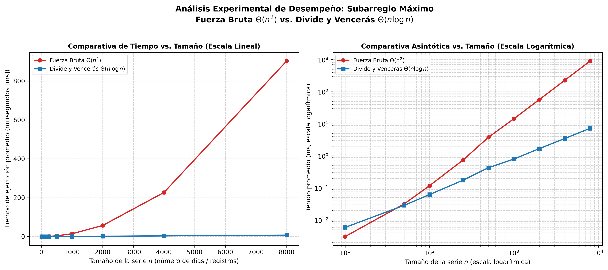

# Laboratorio Evaluativo 02: Dividir y Vencer — Subarreglo Máximo

- **Estudiante:** Camilo Ospina Hernández
- **Correo Institucional:** camiloospina318319@correo.itm.edu.co
- **Asignatura:** Análisis y Diseño de Algoritmos
- **Semestre:** 2026-2
- **Situación Problema:** Cooperativa de 1.500 tiendas de barrio — Detección de la mejor racha de variación diaria de caja

---

## Instrucciones de Reproducción

Para ejecutar de manera íntegra y reproducible las pruebas unitarias y el experimento de medición de tiempos, ejecute los siguientes comandos desde la raíz del repositorio (`curso-analisis-algoritmos`):

```powershell
# 1. Activar el entorno virtual de Python
.\venv\Scripts\Activate.ps1

# 2. Instalar dependencias requeridas (si no están instaladas)
pip install -r requirements.txt

# 3. Ejecutar la batería de pruebas unitarias y verificación formal
python lab2-divide-y-vencer\pruebas.py

# 4. Ejecutar el protocolo experimental de medición y regenerar la gráfica
python lab2-divide-y-vencer\medicion.py
```

> **Nota:** Los scripts también pueden ejecutarse posicionándose directamente dentro de la carpeta `lab2-divide-y-vencer/` ejecutando `python pruebas.py` y `python medicion.py`.

---

## Parte 1 — Implementación y Verificación de las Soluciones

La implementación de los algoritmos se encuentra en [subarreglo.py](subarreglo.py) y la suite de pruebas automatizadas en [pruebas.py](pruebas.py).

### Descripción de la Verificación y Casos Cubiertos
Para certificar la corrección de `subarreglo_fuerza_bruta` ($\Theta(n^2)$) y `subarreglo_maximo` ($\Theta(n \log n)$), se construyó un arnés de pruebas basado en aserciones (`assert`) que valida tanto la suma máxima obtenida como la inmutabilidad de las estructuras de entrada:

1. **Serie de la Situación Problema (8 días):** Se probó la serie histórica de la cooperativa `[-3, 5, -2, 8, -6, 3, 9, -4]`, confirmando que ambos algoritmos identifican la racha óptima con suma exacta de `+17` (tramo del día 2 al 7) y que la lista original no es alterada.
2. **Series de un Solo Elemento:** Se evaluaron listas unitarias tanto con valores positivos (`[42.5]`) como negativos (`[-15.0]`), verificando el caso base directo en los índices `(0, 0)`.
3. **Series con Todos los Valores Negativos:** En un escenario adverso donde toda variación es pérdida (ej. `[-24, -5, -12, -3, -8, -19]`), se constató que la suma devuelta corresponde al elemento menos negativo (`-3`), evitando selecciones vacías inválidas.
4. **Series con Todos los Valores Positivos:** Se validó que, ante crecimientos continuos, el algoritmo seleccione la secuencia completa como suma total.
5. **Caso de Tramo Cruzado Específico:** Se diseñó una serie simétrica (`[-10, 8, 7, 9, 6, -15]`) donde la solución óptima reside estrictamente cruzando el punto medio (`[8, 7, 9, 6]`, suma `30`), corroborando el correcto funcionamiento de `suma_cruzada`.
6. **Muestreo Aleatorio Masivo (30 listas):** Se generaron 30 instancias aleatorias con longitudes variables entre 2 y 200 elementos y valores entre -100 y 100, verificando que en el 100 % de los casos la suma calculada por Divide y Vencerás sea idéntica a la obtenida por Fuerza Bruta.

---

## Parte 2 — Medición Experimental y Gráfica

El código del experimento de rendimiento se encuentra en [medicion.py](medicion.py).

### Metodología de Medición
Las mediciones se realizaron bajo un protocolo experimental riguroso:
- **Tallas evaluadas:** 9 tamaños de entrada: $n \in [10, 50, 100, 250, 500, 1000, 2000, 4000, 8000]$. Cubre dos tamaños menores a 100 ($10, 50$) y tamaños mayores o iguales a 4000 ($4000, 8000$), incluyendo duplicaciones sucesivas para contrastar la razón de cambio asintótica.
- **Generación de datos y reproducibilidad:** Datos enteros en el rango $[-100, 100]$ generados mediante semilla fija controlada (`semilla=42`). En cada tamaño, exactamente la misma lista fue evaluada por ambos algoritmos.
- **Aislamiento del cronometraje:** Se cronometró exclusivamente la llamada a la función algorítmica utilizando `time.perf_counter()`, aislando por completo los tiempos de inicialización y memoria.
- **Mitigación de ruido del sistema operativo:** Cada algoritmo se ejecutó **5 veces consecutivas por tamaño**, calculando el promedio aritmético de los tiempos y verificando en cada iteración la igualdad exacta de la suma (`assert math.isclose(suma_fb, suma_dv)`).

### Resultados Experimentales

| $n$ (Días / Registros) | Tiempo Fuerza Bruta (ms) | Tiempo Divide y Vencerás (ms) | Suma Máxima | Validación |
| :---: | :---: | :---: | :---: | :---: |
| 10 | 0.0031 | 0.0059 | 139.0 | Correcto |
| 50 | 0.0317 | 0.0287 | 635.0 | Correcto |
| 100 | 0.1176 | 0.0623 | 351.0 | Correcto |
| 250 | 0.7460 | 0.1749 | 1348.0 | Correcto |
| 500 | 3.8103 | 0.4298 | 1069.0 | Correcto |
| 1.000 | 14.3747 | 0.7989 | 1859.0 | Correcto |
| 2.000 | 56.8755 | 1.6848 | 2778.0 | Correcto |
| 4.000 | 226.7291 | 3.4773 | 2152.0 | Correcto |
| 8.000 | 902.7761 | 7.2345 | 3808.0 | Correcto |

### Gráfica Comparativa



---

## Parte 3 — Análisis Teórico y Discusión

### 1. Recurrencia, Método Maestro y Complejidad de Fuerza Bruta
`subarreglo_maximo` divide la serie en 2 subproblemas de tamaño $n/2$. Dividir (punto medio) y combinar comparando las 3 sumas candidatas cuesta $\Theta(1)$. `suma_cruzada` efectúa dos barridos lineales sumando los $n$ elementos, con costo $\Theta(n)$. La recurrencia es:
$$T(n) = 2T(n/2) + \Theta(n), \quad T(1) = \Theta(1)$$
Por Teorema Maestro ($T(n) = aT(n/b) + f(n)$), con $a = 2$, $b = 2$ y $f(n) = \Theta(n)$, el umbral crítico es $n^{\log_b a} = n^{\log_2 2} = n$. Dado que $f(n) = \Theta(n^{\log_b a}) = \Theta(n)$, aplica el **Caso 2**, concluyendo que $T(n) = \Theta(n \log n)$.

`subarreglo_fuerza_bruta` usa dos ciclos anidados: el exterior fija el inicio $i$ ($n$ pasos) y el interior acumula la suma hasta $j$ ($n-i$ pasos con trabajo $\Theta(1)$). El total de operaciones es $\sum_{i=0}^{n-1}(n-i) = \frac{n(n+1)}{2} = \frac{1}{2}n^2 + \frac{1}{2}n$, siendo su complejidad estrictamente $\Theta(n^2)$.

### 2. Lo Medido contra lo Esperado
En la gráfica lineal, Fuerza Bruta describe una parábola acelerada hasta $902.78\text{ ms}$ en $n=8000$, mientras Divide y Vencerás se mantiene casi plana con apenas $7.23\text{ ms}$. En escala logarítmica, la pendiente de Fuerza Bruta duplica la de Divide y Vencerás.

Al duplicar de $n_1=4000$ a $n_2=8000$:
- **Fuerza Bruta:** pasa de $226.73\text{ ms}$ a $902.78\text{ ms}$ (factor de $3.98\times$). Concuerda con la predicción teórica $\Theta(n^2)$, donde duplicar $n$ cuadruplica el tiempo: $(2n)^2/n^2 = 4\times$.
- **Divide y Vencerás:** pasa de $3.48\text{ ms}$ a $7.23\text{ ms}$ (factor de $2.08\times$). La predicción para $\Theta(n \log n)$ es $\frac{2n \log_2(2n)}{n \log_2 n} \approx 2.17\times$, confirmando un crecimiento cuasi-lineal.

### 3. Tamaños Pequeños y Umbral de Ventaja
Existe un punto de cruce (*crossover point*): para $n = 10$, Fuerza Bruta supera a Divide y Vencerás ($0.0031\text{ ms}$ vs. $0.0059\text{ ms}$). En $n = 50$, Divide y Vencerás ya toma ventaja ($0.0287\text{ ms}$ vs. $0.0317\text{ ms}$). El umbral de ganancia se sitúa entre $n \approx 25$ y $n \approx 40$.

Fuerza Bruta aventaja en listas mínimas por su baja constante oculta (bucle cerrado en memoria contigua). Divide y Vencerás añade la sobrecarga (*overhead*) de llamadas recursivas, marcos de pila y tuplas en Python, costo administrativo que en tallas diminutas supera el beneficio algorítmico.

### 4. ¿Cuándo Conviene Dividir? (Máximo de un Arreglo)
Para hallar el máximo de un arreglo, el algoritmo lineal iterativo realiza $n-1$ comparaciones directas, con costo $\Theta(n)$ y memoria $\Theta(1)$.

Si dividimos en dos mitades de tamaño $n/2$ y combinamos con una comparación entre ambos máximos ($\Theta(1)$), la recurrencia es $T(n) = 2T(n/2) + \Theta(1)$. Por Teorema Maestro ($a=2, b=2, f(n)=\Theta(1)$), $n^{\log_2 2} = n$. Como $f(n) = O(n^{1-\epsilon})$ con $\epsilon=1$, aplica el **Caso 1**: $T(n) = \Theta(n)$.

Dividir no mejora la complejidad frente al recorrido simple y añade overhead recursivo. Dividir y vencer solo conviene cuando particionar y combinar reduce la cota asintótica (de $\Theta(n^2)$ a $\Theta(n \log n)$). Si el problema ya es lineal y la combinación no baja el orden de magnitud, dividir es contraproducente.

### 5. Concepto Técnico para la Gerencia
Recomiendo categóricamente **Divide y Vencerás** para la cooperativa.

*Estimación para $N = 1.000.000$ de registros (base empírica $n_0 = 8000$, $k = 125$):*
- **Fuerza Bruta:** Al ser $\Theta(n^2)$, escala por $k^2 = 125^2 = 15.625$:
  $$T_{FB}(10^6) \approx 0.9028\text{ s} \times 15.625 \approx 14.106\text{ s} \approx \mathbf{3\text{ horas y } 55\text{ minutos}}$$
  Para 1.500 tiendas requeriría más de 240 días de CPU continua; es inviable.
- **Divide y Vencerás:** Escala según $\frac{N \log_2 N}{n_0 \log_2 n_0} = 125 \times \frac{\log_2(10^6)}{\log_2(8000)} \approx 192.15$:
  $$T_{DV}(10^6) \approx 0.0072\text{ s} \times 192.15 \approx \mathbf{1.39\text{ segundos}}$$

Divide y Vencerás reduce el cálculo de 4 horas a solo 1.4 segundos por serie, asegurando escalabilidad total.
